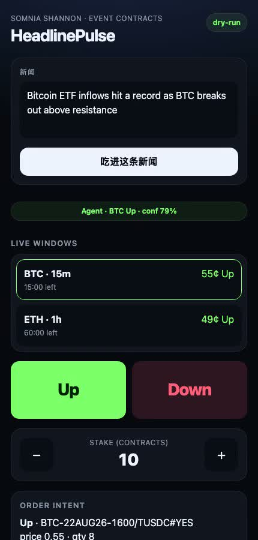

# HeadlinePulse

**A headline in. An Up or Down buy on a live DreamDEX Event Contract.**

News-driven agent + mobile-first Up/Down UI for [Somnia × DreamDEX Event Contracts](https://dorahacks.io/hackathon/event-contracts) on **Shannon** (chain id `50312`).

Team: **Qidianyan Tech** / **yvzhou142857** · GitHub **[Qidianyan/headlinepulse](https://github.com/Qidianyan/headlinepulse)**

**Demo video (2 min 28 sec):** [headlinepulse.mp4](https://github.com/Qidianyan/headlinepulse/releases/download/demo-2026-08-22/headlinepulse.mp4) · [release](https://github.com/Qidianyan/headlinepulse/releases/tag/demo-2026-08-22)



Not a generic prediction mock. Orders go through `@somnia-chain/markets-sdk` **0.28.1** — not the DreamDEX **spot** HTTP API (`/v0/markets`).

## Why

Traders already have a view from the tape (ETF inflows, hacks, SEC delays). The 15-minute Event Contract window is gone while they translate that view into venue units. HeadlinePulse is the last mile: **marketId, tick, lot, on-chain Trading (1)**.

## What it does

1. Reads a headline → BTC or ETH, **Up** or **Down**.
2. Picks a binary window that is **on-chain Trading (status = 1)** and not near expiry.
3. Snaps Up probability in **(0, 1)** to the tick as integers. **Down = 1 − Up**. Size to the lot grid.
4. Emits a CLOB **buy** on the YES or NO tradable. Default **dry-run**.
5. Redeems settled markets from the **Finalized** list (`loadMarkets` has already dropped them). Keys state by **marketId / symbol**, never a recycled pool address.

CLI and phone UI share the same mapper (`mapNewsToIntent`).

## Run (what a judge clones)

```bash
npm install
npm test
npm run agent -- --news "Bitcoin ETF inflows hit a record as BTC breaks out above resistance"
npm run ui
```

- Agent default: fixture markets + **dry-run** (no RPC, no signer).
- UI: [http://127.0.0.1:4173/ui/](http://127.0.0.1:4173/ui/) or open `ui/index.html` from disk (`file://` + plain scripts). Button **吃进这条新闻** reads the tape.
- Live discovery (optional): `npm run discover` — Shannon RPC + DreamDEX indexer.
- Live order (optional): `.env` from `.env.example`, `PRIVATE_KEY`, `DRY_RUN=0`, `--live`. Writes still **gate on Trading (1)**.

Paste fields for DoraHacks: [`SUBMISSION.md`](./SUBMISSION.md). Talk track: [`DEMO_SCRIPT.md`](./DEMO_SCRIPT.md). Local copy of the mp4: [`demo/headlinepulse.mp4`](./demo/headlinepulse.mp4).

## How to get test STT

Shannon gas is **STT**. Event Contract collateral on testnet is faucet **TestUSDC** (6 decimals), not 18-decimal mainnet USDso.

1. Add Shannon: chain id `50312`, RPC `https://api.infra.testnet.somnia.network` (alias `https://dream-rpc.somnia.network`), explorer [shannon-explorer.somnia.network](https://shannon-explorer.somnia.network).
2. Claim STT:
   - [testnet.somnia.network](https://testnet.somnia.network/)
   - [Google Cloud Shannon faucet](https://cloud.google.com/application/web3/faucet/somnia/shannon)
   - [Stakely STT faucet](https://stakely.io/faucet/somnia-testnet-stt)
   - [thirdweb Shannon faucet](https://thirdweb.com/somnia-shannon-testnet)
   - Contest Telegram ([RULES.md](./RULES.md)): [t.me/+XHq0F0JXMyhmMzM0](https://t.me/+XHq0F0JXMyhmMzM0)
3. Collateral: funded key, then `exchange.trader.faucet()` on Shannon. BinaryMarketsModule (same address testnet/mainnet): `0x3ecC694Cef705358864a646142ac17A90E29e388`. Never hardcode a **market or pool** address.

## Stack

| Piece | Surface |
| --- | --- |
| Event Contracts | `SomniaMarkets` / `isBinaryMarket` / `getMarketOnchain` / `createOrder` / `listPastBinaryMarkets({ status: "Finalized" })` |
| Chain | Shannon `50312`, indexer `https://dev.smk.somnia.host/v1/graphql` |
| Agent | `src/cli.js` → `mapNewsToIntent` |
| UI | `ui/index.html` (no bundler, no `type=module`) |
